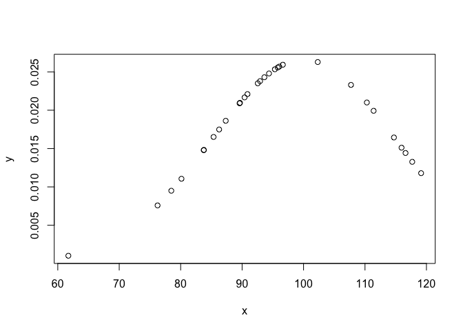

Ejercicios Tema 2
================

**Ejercicio 2.3.**  
*Supongamos que tenemos tres vectores de igual longitud, X, Y y Z, y
queremos obtener la matriz de correlaciones. Nada más fácil: sabiendo
que cor() proporciona lo que queremos, vamos a la consola y escribimos:*

``` r
X <- rnorm(100)
Y <- X + (rnorm(100)/2)
Z <- Y + (rnorm(100)/2)

#Solo nos permite correlación entre 2 varibles. 
# cor(X, Y, Z)

#Honestamente, es mejor trabajar con DF la mayor parte del tiempo. Ahorra tiempo y muchas veces 
# simplifica la vida. ¿Puede ser un poquito overkill? Si. Mejor que zozobre que no que zofalte.
df <- data.frame(X, Y, Z)

cor(df)
```

    ##           X         Y         Z
    ## X 1.0000000 0.9031589 0.8171852
    ## Y 0.9031589 1.0000000 0.9233153
    ## Z 0.8171852 0.9233153 1.0000000

**Ejercicio 2.4.**  
*Vamos a crear un vector atómico de cada uno de los cinco tipos vistos
hasta ahora, con dos condiciones: primera, se crearan en orden,
empezando por el tipo que menos versatilidad tiene y acabando con el que
más; segundo, han de tener longitud creciente, comenzando en dos.*
*Consulta el tipo y la estructura de cada vector creado.*

``` r
#Bolean
bol <-  c(TRUE, FALSE)

#Integer
int <- 1:3

#Double
dbl <- c(3.14, 2.71828, 6.022e23, 1.6618)

#Complex 
#A saber, hace falta indicar delante de 'i' una cifra para que sepa que es un número
# imaginario.
cplx <- c(1+1i, 0+1i, -2+3i, 7+5i, 11-13i)

#String
letr <- c("Esto", "es", "un", "texto", "breve", "en", "una variable de 7 elementos, ¡ja!")

#Como soy bastante perezoso comprobamos mediante un bucle for. Para ello, crearé una 
#lista con las variables y la recorreré con el bucle.
variables <- list(bol, int, dbl, cplx, letr)

# Usando str() directamente ya te indica el tipo, estrucutra y ¡hasta los primero elementos!,
# por lo que no lo voy a añadir al ejercicio. 
for (val in variables) { cat(paste(str(val), '\n' ))}
```

    ##  logi [1:2] TRUE FALSE
    ##  
    ##  int [1:3] 1 2 3
    ##  
    ##  num [1:4] 3.14 2.72 6.02e+23 1.66
    ##  
    ##  cplx [1:5] 1+1i 0+1i -2+3i ...
    ##  
    ##  chr [1:7] "Esto" "es" "un" "texto" "breve" "en" ...
    ## 

**Ejercicio 2.5.**  
*Utilizando los vectores construidos en el ejercicio anterior, crea una
lista con tres componentes. Construye también un data frame con los dos
vectores que no usaste para la lista. Probablemente tendrás que hacer
algún ajuste respecto a la longitud de los componentes.* *Prueba a crear
otras listas y data frames con otras combinaciones de esos mismos
componentes.*

``` r
#Creamos una lista con bol, cplx y num. 
variables <- list(int, cplx, letr)
variables
```

    ## [[1]]
    ## [1] 1 2 3
    ## 
    ## [[2]]
    ## [1]  1+ 1i  0+ 1i -2+ 3i  7+ 5i 11-13i
    ## 
    ## [[3]]
    ## [1] "Esto"                              "es"                               
    ## [3] "un"                                "texto"                            
    ## [5] "breve"                             "en"                               
    ## [7] "una variable de 7 elementos, ¡ja!"

``` r
df <- data.frame(bol, dbl)
df
```

    ##     bol         dbl
    ## 1  TRUE 3.14000e+00
    ## 2 FALSE 2.71828e+00
    ## 3  TRUE 6.02200e+23
    ## 4 FALSE 1.66180e+00

**Ejercicio 2.6.**  
*Construye toda una serie de objetos (vectores atómicos, matriz, lista,
data frame) y consulta para cada uno su tipo, clase y longitud. Usa la
función attributes() para conocer los atributos de cada objeto.*

``` r
#Vector atómico num
num <- 2:7
#Vector atómico char
letrs <- LETTERS[1:6]
#Lista
lst <- list(primero = 'uno', segundo = 'dos', tercero='Nada',
            cuarto= 'tres', quinto='membrillo', sexto='Mediana')
#DataFrames
df <- data.frame(num, letrs)
#Matricez
mtrx <- matrix(num, 2, 3)

#Tipo typeof(), clase class(), longitud length() y atributos attributes()
#Para ahorrar en codigo repetirmos la técnica del bucle.
#Creamos una lista que podamos recorrer con el bucle donde tambien asignamos
#nombres a las variables de ahí el 'num=num' el primer 'num' es el nombre, el
#segundo le asigna el 'contenido'.
variables <- list(num=num, letrs=letrs, lst=lst, df=df, mtrx=mtrx)

#Creamos el bucle.
for (var in variables){
  print(var)
  print(typeof(var))
  print(class(var))
  print(length(var))
  print(attributes(var))
  cat('\n')
  
}
```

    ## [1] 2 3 4 5 6 7
    ## [1] "integer"
    ## [1] "integer"
    ## [1] 6
    ## NULL
    ## 
    ## [1] "A" "B" "C" "D" "E" "F"
    ## [1] "character"
    ## [1] "character"
    ## [1] 6
    ## NULL
    ## 
    ## $primero
    ## [1] "uno"
    ## 
    ## $segundo
    ## [1] "dos"
    ## 
    ## $tercero
    ## [1] "Nada"
    ## 
    ## $cuarto
    ## [1] "tres"
    ## 
    ## $quinto
    ## [1] "membrillo"
    ## 
    ## $sexto
    ## [1] "Mediana"
    ## 
    ## [1] "list"
    ## [1] "list"
    ## [1] 6
    ## $names
    ## [1] "primero" "segundo" "tercero" "cuarto"  "quinto"  "sexto"  
    ## 
    ## 
    ##   num letrs
    ## 1   2     A
    ## 2   3     B
    ## 3   4     C
    ## 4   5     D
    ## 5   6     E
    ## 6   7     F
    ## [1] "list"
    ## [1] "data.frame"
    ## [1] 2
    ## $names
    ## [1] "num"   "letrs"
    ## 
    ## $class
    ## [1] "data.frame"
    ## 
    ## $row.names
    ## [1] 1 2 3 4 5 6
    ## 
    ## 
    ##      [,1] [,2] [,3]
    ## [1,]    2    4    6
    ## [2,]    3    5    7
    ## [1] "integer"
    ## [1] "matrix" "array" 
    ## [1] 6
    ## $dim
    ## [1] 2 3

**Ejercicio 2.7.**  
*Utiliza los objetos construidos en el ejercicio anterior y asigna
nombres a algunos de ellos. Observa el comportamiento de names() con
matrices y data frames.* *Luego consulta sus atributos y estructura.*

``` r
names(num) <- LETTERS[1:6];num
```

    ## A B C D E F 
    ## 2 3 4 5 6 7

``` r
#¿Porqué 6:11 y no 6:12? Por que el 6 inicial se incluye. 
names(letrs) <- 6:11;letrs 
```

    ##   6   7   8   9  10  11 
    ## "A" "B" "C" "D" "E" "F"

``` r
#Ciudado, presta atención a los detalles. Estamos añadiendo nombres a las columnas del
# del df, ¡no valores!
names(df) <- c("Num", "letrs");str(df)
```

    ## 'data.frame':    6 obs. of  2 variables:
    ##  $ Num  : int  2 3 4 5 6 7
    ##  $ letrs: chr  "A" "B" "C" "D" ...

``` r
names(mtrx) <- LETTERS[1:6];mtrx
```

    ##      [,1] [,2] [,3]
    ## [1,]    2    4    6
    ## [2,]    3    5    7
    ## attr(,"names")
    ## [1] "A" "B" "C" "D" "E" "F"

``` r
rm(lst)
lst <- list(num, letrs, df)
names(lst) <- c('num', 'letrs', 'df');lst
```

    ## $num
    ## A B C D E F 
    ## 2 3 4 5 6 7 
    ## 
    ## $letrs
    ##   6   7   8   9  10  11 
    ## "A" "B" "C" "D" "E" "F" 
    ## 
    ## $df
    ##   Num letrs
    ## 1   2     A
    ## 2   3     B
    ## 3   4     C
    ## 4   5     D
    ## 5   6     E
    ## 6   7     F

``` r
variables <- list(num=num, letrs=letrs, lst=lst, df=df, mtrx=mtrx)

#Luego consulta sus atributos y estructura… ¿otra vez? Lo suyo sería crear una funcóm o copiar el 
# codigo del ejercicio anterior ejemplo para hacela:
atrib <- function(variables){
  #Para ayudar a la legibilidad del output vamos a poner el nombre de la variable
  #al inicio. Para ello declaramos una variable n que actue de contador y recorra
  #la lista de nombres que devuelve la función names(), si de eso hablaba en el 
  #ejercicio anterior.
  n <- 1
  
  #En caso de duda '\n' es nueva linea o golpe de carro. '\' es un simbolo especial o de escape y le
  #indica a (en este caso) cat() que el siguiente caracter es especial.
  #Iniciamos el bucle
  for (var in variables){
    print(names(variables[n]))
    cat('\nEs de tipo: ',typeof(var))
    cat('\nEs de clase: ', class(var))
    cat('\nEs de longitud: ', length(var))
    #Por la estructura que tiene lo que nos devuelve la función attributes() usar
    # cat() no es una opción así que lo dejaremos así. Se puede ver que cat() y print
    # se comportan de forma distinta.
    cat('\nSus atributos son: \n')
    print(attributes(var))
    cat('\n')
  #Una vez terminado de implimir añadimos uno a n para que en la siguiente iteración
  #se imprima el nombre de la siguiente variable.
    n <- n+1
  }
}

#Para luego hacer la comprobación solo con esta linea de código.
atrib(variables)
```

    ## [1] "num"
    ## 
    ## Es de tipo:  integer
    ## Es de clase:  integer
    ## Es de longitud:  6
    ## Sus atributos son: 
    ## $names
    ## [1] "A" "B" "C" "D" "E" "F"
    ## 
    ## 
    ## [1] "letrs"
    ## 
    ## Es de tipo:  character
    ## Es de clase:  character
    ## Es de longitud:  6
    ## Sus atributos son: 
    ## $names
    ## [1] "6"  "7"  "8"  "9"  "10" "11"
    ## 
    ## 
    ## [1] "lst"
    ## 
    ## Es de tipo:  list
    ## Es de clase:  list
    ## Es de longitud:  3
    ## Sus atributos son: 
    ## $names
    ## [1] "num"   "letrs" "df"   
    ## 
    ## 
    ## [1] "df"
    ## 
    ## Es de tipo:  list
    ## Es de clase:  data.frame
    ## Es de longitud:  2
    ## Sus atributos son: 
    ## $names
    ## [1] "Num"   "letrs"
    ## 
    ## $class
    ## [1] "data.frame"
    ## 
    ## $row.names
    ## [1] 1 2 3 4 5 6
    ## 
    ## 
    ## [1] "mtrx"
    ## 
    ## Es de tipo:  integer
    ## Es de clase:  matrix array
    ## Es de longitud:  6
    ## Sus atributos son: 
    ## $dim
    ## [1] 2 3
    ## 
    ## $names
    ## [1] "A" "B" "C" "D" "E" "F"

**Ejercicio 2.8.**  
*Dado un vector x &lt;- rnorm(30, 100, 15), obtén el vector y tal que:*

$y=f(x)=\\frac{1}{\\sigma\\sqrt{2\\pi}}e^{-\\frac{(x-\\mu)^2}{2\\sigma^2}}$

*Utiliza la menor cantidad de paréntesis posible sin perder claridad.*

``` r
mu <- 100
sigma <- 15
x <- rnorm(30, 100, 15)


y <- (1/(sigma*sqrt(2*pi)))*exp(-((x-mu)**2)/(2*sigma**2))

plot(x,y)
```

<!-- -->

**Ejercicio 2.9.**  
*Con lo que sabemos hasta ahora, vamos a ejecutar cuatro acciones: dos
de ellas con warning y dos que generen un error*

``` r
a1 <- c(1,2,3,4)
a3 <-  c(5,6,7)
#aviso, ya que los vectores son de distinta longitud por lo que para el último
# R usa el primero de la lista, vuelve a empezar.
a1+a3
```

    ## Warning in a1 + a3: longer object length is not a multiple of shorter object
    ## length

    ## [1]  6  8 10  9

``` r
#Aqui todo ok
m1 <- matrix(1:6, 2,3)

#aviso
#Peeero, aquí indicamos 5 valores en para una matriz 2x2, R pasa del último.
m2 <- matrix(4:8, 2,2)
```

    ## Warning in matrix(4:8, 2, 2): data length [5] is not a sub-multiple or multiple
    ## of the number of rows [2]

``` r
#Tengo que comentar ambas lineas porque sino no compila Rmarkdown. 

#Error, no pudes sumar dos matricies 2x3 y 2x2
#m1+m2

#Error, la segunda matriz no está declarada, igual por un error al 
# escribir…
#m1 + m3
```
