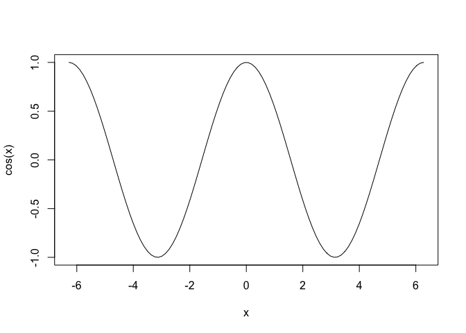

Ejercicios Tema 4
================

**Ejercicio 4.1.**  
*A continuación se muestran varios vectores. Convierte a un vector
entero aquello que **no sean*** *ya enteros. Observa cuáles pueden
coercionarse y cuáles no, y los resultados.*

``` r
v1 <- c("1", "3.14")
v1 <- as.integer(v1)

#v2 <- 1:12
#Ya es entero

#v3 <- seq(2, 6)
#Ya es entero

v4 <- seq(0, 5, length.out = 5)
#Ya es entero… nope. Es double, por lo que tienes que usar as.integer()
v4 <- as.integer(v4)

v5 <- rnorm(10)
v5 <- as.integer(v5)

m <- matrix(1:12, 3, 4)
#Ya es entero, ya que los valores generados son enteros.
```

**Ejercicio 4.2.**  
*Una de las cinco constantes que implementa R es pi. Y uno de los usos
posibles es crear una secuencia de valores entre −2π y 2π para hacer un
gráfico, por ejemplo, de la función coseno.*

``` r
x <- seq(-2*pi, 2*pi, length=100)
plot(x, cos(x), 'l')
```

<!-- -->

**Ejercicio 4.3.**  
*Dado el vector v &lt;- 1:12, sustituye por cero los múltiplos de 3.*

``` r
v <- 1:12
v[v%%3==0] <- 0
```

**Ejercicio 4.4.** *Calcula el sumatorio y el productorio del vector v
&lt;- 1:4.*

``` r
v <- 1:4
sum(v)
```

    ## [1] 10

``` r
prod(v)
```

    ## [1] 24

**Ejercicio 4.5.**  
*Obtenemos los vectores v1 y v2 muestreando 5 elementos del vector v
&lt;- 0:10 mediante la instrucción sample(). Indica, para cada elemento
de v1, si es mayor que el elemento correspondiente de v2.*

``` r
v <- 0:10

(v1 <- sample(v, 5))
```

    ## [1] 2 5 4 9 0

``` r
(v2 <- sample(v, 5))
```

    ## [1]  8  2  9 10  4

``` r
v1 > v2
```

    ## [1] FALSE  TRUE FALSE FALSE FALSE

**Ejercicio 4.6.**  
*Observa el curioso resultado de la siguiente comparación:*

``` r
0.3/3 == 0.4/4
```

    ## [1] FALSE

*¿Por qué ocurre esto? Para localizar el error, comprueba las siguientes
posibilidades:* - *Es un error de precedencia de operadores.* - *Haz que
R muestre más decimales mediante options(digits = 22) y observa el
resultado.* - *Busca en la ayuda el término Comparison para conocer las
particularidades, si las hay, del operador ==.*

``` r
#La primera opción no es.

options(digits = 22)

0.3/3
```

    ## [1] 0.09999999999999999167333

``` r
0.4/4
```

    ## [1] 0.1000000000000000055511

``` r
#Lo que demuestra la importancia de conocer bien el sistema con el que estás trabajando. Una 
# cosa es lo que se muestra, por defecto valores redondeados, y otro con los que trabaja.
options(digits = 7)
```

**Ejercicio 4.7.**  
*En el capítulo se muestra cómo, al utilizar minúsculas, R no reconoce
los valores lógicos TRUE y FALSE, y se limitará a buscar los objetos
indicados (t, f, true, false) para ejecutar el código.*

``` r
#Mirar el ejercicio resuelto para una explicación clara y exhaustiva. 
```

**Ejercicio 4.8.** *A partir de los vectores edad y sexo, definidos a
continuación, muestra el sexo de aquellos sujetos con edades menores de
35 años.*

``` r
edad <- c(25, 32, 40, 31)
sexo <- c("h", "m", "h", "m")
sexo[edad<35]
```

    ## [1] "h" "m" "m"

**Ejercicio 4.9.**  
*A partir del vector alf &lt;- c(‘A’, ‘B’, ‘C’), obtén los vectores
siguientes:*  
- ‘A 1’ ‘B 2’ ‘C 3’ ‘A 4’ ‘B 5’ ‘C 6’  
- ‘A1’ ‘B2’ ‘C3’ ‘A4’ ‘B5’ ‘C6’  
- ‘A2’ ‘B4’ ‘C6’ ‘A2’ ‘B4’ ‘C6’  
- ’A1\_\|*B2*\|*C3*\|*A4*\|*B5*\|\_C6’

``` r
alf <- c('A', 'B', 'C')
(l_1 <- paste(alf, 1:6))
```

    ## [1] "A 1" "B 2" "C 3" "A 4" "B 5" "C 6"

``` r
(l_2 <- paste(alf, 1:6, sep = ''))
```

    ## [1] "A1" "B2" "C3" "A4" "B5" "C6"

``` r
(l_3 <- paste(alf, rep(seq(2,6,2),2), sep = ''))
```

    ## [1] "A2" "B4" "C6" "A2" "B4" "C6"

``` r
(l_4 <- paste(alf,1:6, sep='',collapse = '_|_'))
```

    ## [1] "A1_|_B2_|_C3_|_A4_|_B5_|_C6"

**Ejercicio 4.10.**  
*Genera los nombres para las variables que almacenan las respuestas a 10
test (nombrados A, B, C. . . ), cada uno con 5 ítems. Los nombres deben
tener el formato: A\_1, A\_2,…, A\_5,…, J\_1, J\_2, J\_3, J\_4, J\_5.*

``` r
(nombres <- paste(rep(LETTERS[1:10], each=5),
                  1:5, 
                  sep = '_'))
```

    ##  [1] "A_1" "A_2" "A_3" "A_4" "A_5" "B_1" "B_2" "B_3" "B_4" "B_5" "C_1" "C_2"
    ## [13] "C_3" "C_4" "C_5" "D_1" "D_2" "D_3" "D_4" "D_5" "E_1" "E_2" "E_3" "E_4"
    ## [25] "E_5" "F_1" "F_2" "F_3" "F_4" "F_5" "G_1" "G_2" "G_3" "G_4" "G_5" "H_1"
    ## [37] "H_2" "H_3" "H_4" "H_5" "I_1" "I_2" "I_3" "I_4" "I_5" "J_1" "J_2" "J_3"
    ## [49] "J_4" "J_5"

**Ejercicio 4.11.**  
*La función print() tiene más argumentos que explorar. Utiliza la ayuda
de la función y, partiendo del vector cad, estudia las siguientes
instrucciones y predice qué se obtendrá en cada caso. Comenzamos
definiendo el vector:*

``` r
cad <- c("Uno", "Dos", "Tres", NA, "Cinco")

 print(cad)
```

    ## [1] "Uno"   "Dos"   "Tres"  NA      "Cinco"

``` r
 print(cad, quote = F)
```

    ## [1] Uno   Dos   Tres  <NA>  Cinco

``` r
 print(cad, na.print = "---")
```

    ## [1] "Uno"   "Dos"   "Tres"  ---     "Cinco"

``` r
 print(cad, right = T)
```

    ## [1]   "Uno"   "Dos"  "Tres"      NA "Cinco"

``` r
 print(cad, max = 3)
```

    ## [1] "Uno"  "Dos"  "Tres"
    ##  [ reached getOption("max.print") -- omitted 2 entries ]

**Ejercicio 4.12.**  
*Crea la matrix P, de dimensión 3 × 4, que contiene los 12 primeros
números primos. A partir de ahí extrae:* - *la primera fila;*  
- *la segunda columna;*  
- *el valor de la segunda fila y cuarta columna;*  
- *las filas dos y tres;*  
- *las columnas dos y cuatro;*  
- *la intersección de lo indicado en los dos apartados anteriores;*  
- *todo lo no incluido en las filas 2 y 3 y en las columnas 2 y 4;*  
- *la tercera fila, sin perder su clase matrix.*

``` r
primos <- c(2, 3, 5, 7, 11, 13, 17, 19, 23, 29, 31, 37)
P <- matrix(primos, 3,4)
# La primera fila
P[1,]
```

    ## [1]  2  7 17 29

``` r
# La segunda columna
P[,2]
```

    ## [1]  7 11 13

``` r
# El valor de la segunda fila y cuarta columna
P[2,4]
```

    ## [1] 31

``` r
# Las filas dos y tres
P[2:3,]
```

    ##      [,1] [,2] [,3] [,4]
    ## [1,]    3   11   19   31
    ## [2,]    5   13   23   37

``` r
# Las columnas dos y cuatro
P[,c(2,4)]
```

    ##      [,1] [,2]
    ## [1,]    7   29
    ## [2,]   11   31
    ## [3,]   13   37

``` r
# La intersección de lo indicado en los dos apartados anteriores
P[2:3,c(2,4)]
```

    ##      [,1] [,2]
    ## [1,]   11   31
    ## [2,]   13   37

``` r
# Todo lo no incluido en las filas 2 y 3 y en las columnas 2 y 4
P[-c(2:3),-c(2,4)]
```

    ## [1]  2 17

``` r
# La tercera fila, sin perder su clase matrix
P[3, , drop=F]
```

    ##      [,1] [,2] [,3] [,4]
    ## [1,]    5   13   23   37

**Ejercicio 4.13.**  
*A partir de la matriz P del ejercicio anterior:*  
- *comprueba que P es un objeto de clase matrix;*  
- *obtén la suma de todos sus elementos;*  
- *obtén la suma de las columnas y la media de las filas;*  
- *obtén el quinto valor primo;*

``` r
# Comprueba que P es un objeto de clase matrix
class(P) 
```

    ## [1] "matrix" "array"

``` r
#o
is.matrix(P)
```

    ## [1] TRUE

``` r
# Obtén la suma de todos sus elementos
sum(P)
```

    ## [1] 197

``` r
# Obtén la suma de las columnas y la media de las filas
colSums(P)
```

    ## [1] 10 31 59 97

``` r
rowMeans(P)
```

    ## [1] 13.75 16.00 19.50

``` r
# Obtén el quinto valor primo
P[5]
```

    ## [1] 11

**Ejercicio 4.14.**  
*El vector reg &lt;- c(‘AND’, ‘EXT’, ‘MAD’, ‘AND’, ‘EXT’, ’AND) recoge
la región de procedencia de una serie de registros; a partir de él:* -
*Crea el factor freg y muéstralo*  
- *Comprueba su tipo, clase y atributos.*  
- *Comprueba sus niveles: número y etiquetas.*  
- *Extrae ahora el vector reg2, con los códigos de los niveles.*

``` r
reg <- c('AND', 'EXT', 'MAD', 'AND', 'EXT', 'AND')
# Crea el factor freg y muéstralo
(rgstr <- factor(reg))
```

    ## [1] AND EXT MAD AND EXT AND
    ## Levels: AND EXT MAD

``` r
# Comprueba su tipo, clase y atributos
#¿Os acordaís de aquella función que escribimos para comprobar este tipo de datos?
#Pues la guardé en un script llamado atrib.R y así me ahorro escribir código.
source('atrib.R')

#Le pasamos los datos a la función como lista.
atrib(list(rgstr))
```

    ## NULL
    ## 
    ## Es de tipo:  integer
    ## Es de clase:  factor
    ## Es de longitud:  6
    ## Sus atributos son: 
    ## $levels
    ## [1] "AND" "EXT" "MAD"
    ## 
    ## $class
    ## [1] "factor"

``` r
#Comprueba sus niveles: número y etiqueta
str(rgstr)
```

    ##  Factor w/ 3 levels "AND","EXT","MAD": 1 2 3 1 2 1

``` r
#Extrae ahora el vector reg2, con los códigos de los niveles
#reg2 <- attributes(rgstr)$levels
#Mal, te piden el vector, pero como números, en código.
#Así que la respuesta correcta es:
(reg2 <- as.numeric(rgstr))
```

    ## [1] 1 2 3 1 2 1

``` r
#La opción de as.integer también funciona.
(reg <- as.integer(rgstr))
```

    ## [1] 1 2 3 1 2 1
